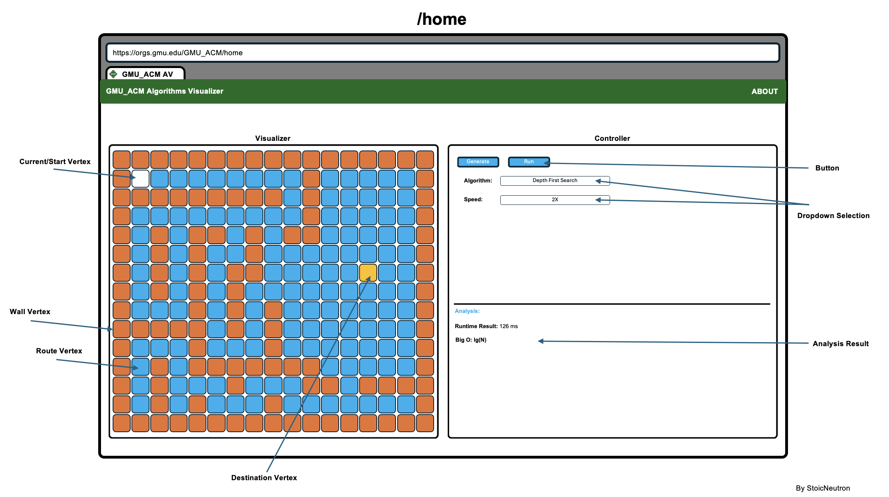

<h1>GMU ACM Algorithm Visualizer</h1>
<h3>Introduction</h3>
<h5>Welcome to the GMU ACM Algorithm Visualizer! </h4>

This innovative web application and PC GUI application is designed for the visual exploration of a wide range of algorithms. Developed with a focus on interactivity and user engagement, our visualizer serves as a valuable educational tool for both students and enthusiasts eager to delve into algorithmic concepts.

Leveraging the powerful and modern capabilities of Next.js, our project ensures a seamless and efficient user experience.

<h3>Features</h3>

<b>Interactive Visualization:</b> Step through algorithms at your own pace to understand their mechanics and intricacies. <b>Diverse Algorithm Set:</b> From sorting to graph algorithms, explore a vast array of computational methods. <b>User-friendly Interface:</b> Navigate through our intuitive layout to focus on learning rather than figuring out controls.

<h3>Visuals</h3>
<h5>Home Screen:</h6>

<i>The home screen presents a dynamic grid where algorithms come to life. Customize your experience with adjustable speeds and step through each process for a thorough understanding.</i>

 

<h5>About Section:</h5>

<i>Learn more about the project, its history, and the team behind it. This section provides insight into our mission and the core values of GMU ACM.</i>

 

<h3>Contributing</h3>

As a collective initiative of ACM GMU members, we thrive on collaboration. Contributions are not just welcomed; they are essential to the growth and improvement of this project. Here's how you can contribute:

<h3>Report an issue</h3>
<ol>
  <li>Navigate to the Issues Tabs or click here: https://github.com/StoicNeutron/GMU_ACM/issues</li>
  <li>Click on the <b>New Issue Button</b> in order to report an issue. Issue doesn't always refers to a bug within the existing software, it also refers to new feature suggestion, documentation typo or improvemnt suggestion. Issue is like a Jira (for those who already been in the professional work).</li>
  <li>Fill out your issue information. Make sure to link the issue to the GMU_ACM at the right hand side title Project.</li>
  <li>You're all set! The issue will be review before it is pass to the ready board for developers to pick it up and work on resolving it.</li>
</ol>

<h3>Resolve an issue:</h3>
<ol>
  <li>Navigate to the Project Tabs or click here: https://github.com/users/StoicNeutron/projects/3 </li>
  <li>In the Ready Board, pick one issue that you think you can handle or complete within a week or two. Then in the issue, click asign it to yourself.</li>
  <li>Drag and drop the issue you picked to the in Progress Board.</li>
  <li>When work is complete, Within your pull request, please mention <code>close #issueID</code> in your pull request description.</li>
  <li>You're all set! The pull request will be review us before accept to merge with the main branch.</li>
</ol>

<h3>Code of Conduct</h3>
<ul>
  <li><b>Respect</b>: Treat everyone with respect and kindness. Be considerate of others' opinions, experiences, and backgrounds.</li>
  <li><b>Inclusivity</b>: Welcome and support people of all backgrounds, identities, and levels of experience. Encourage a diverse and inclusive community.</li>
  <li><b>Constructive Feedback</b>: Provide constructive feedback and criticism. Focus on the content of the ideas rather than the individual presenting them.</li>
  <li><b>Open-mindedness</b>: Be open to different ideas and perspectives. Be willing to learn from others and adapt your viewpoints.</li>
</ul>

<h3>Acknowledgment</h3>

By participating in this project, you are expected to uphold to the Code of Conduct above. If you witness or experience behavior that violates this Code of Conduct, please report it by contacting any of our GMU ACM officers within the Discord Server . All reports will be kept confidential.

Happy coding! If you have any questions or need assistance, feel free to reach out to any of our ACM GMU officers within the Discord Server. Together, let's build an awesome algorithm visualizer!
